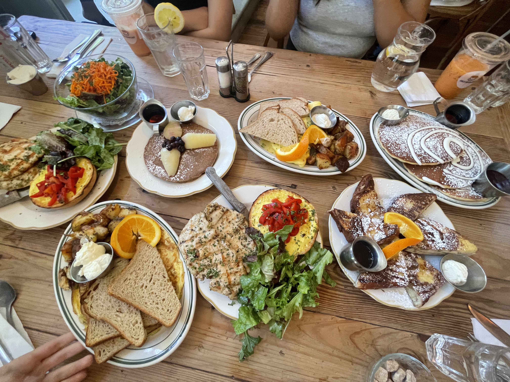
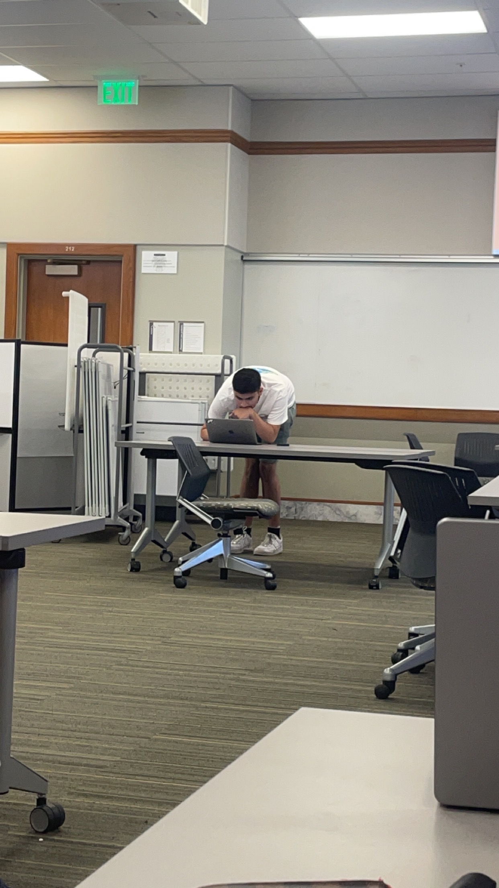
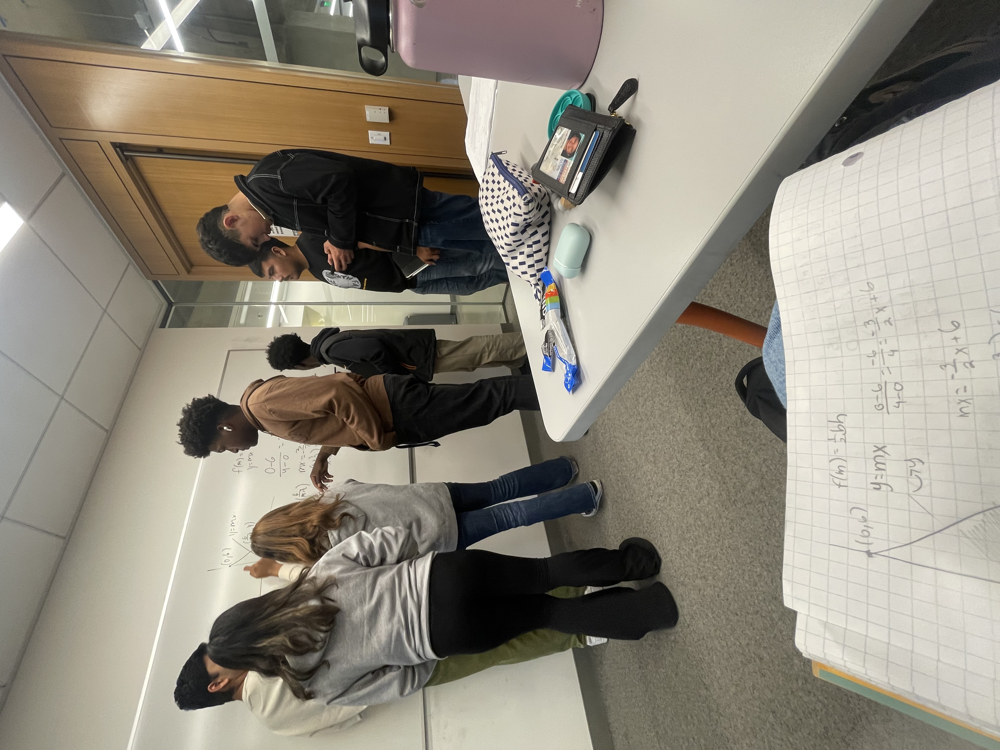
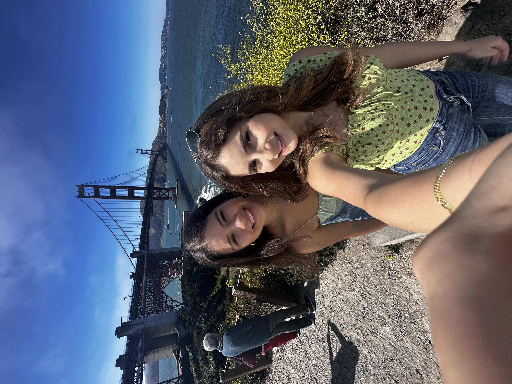
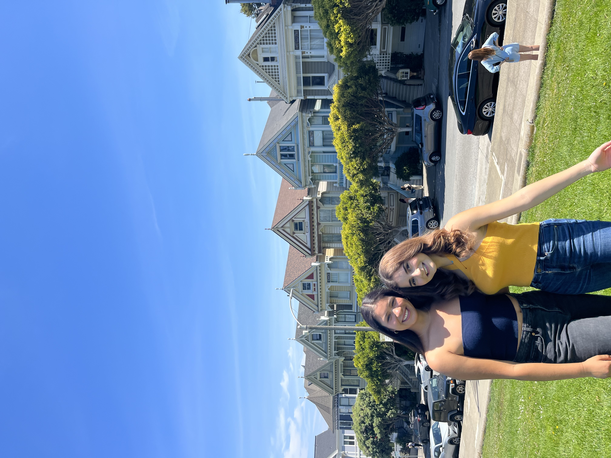
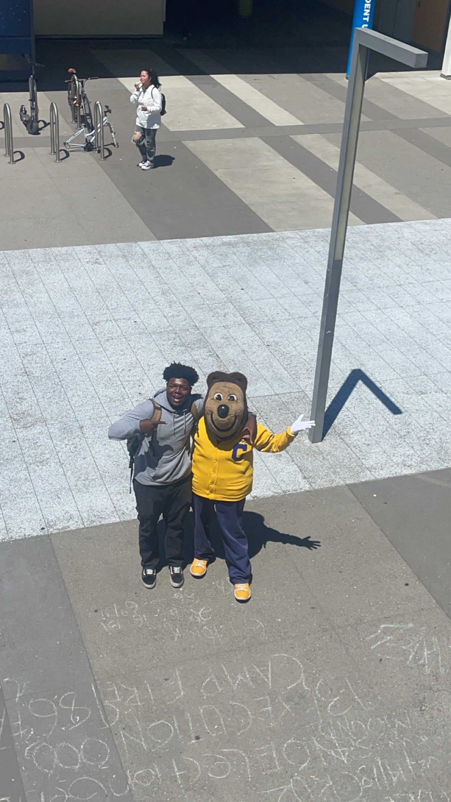
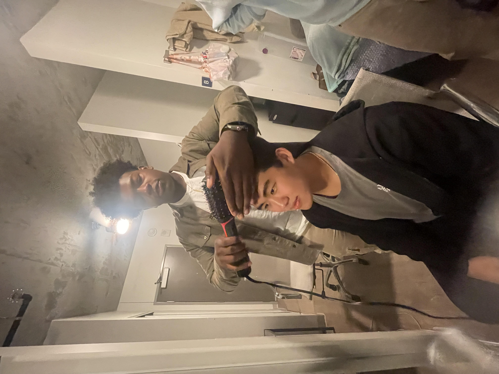
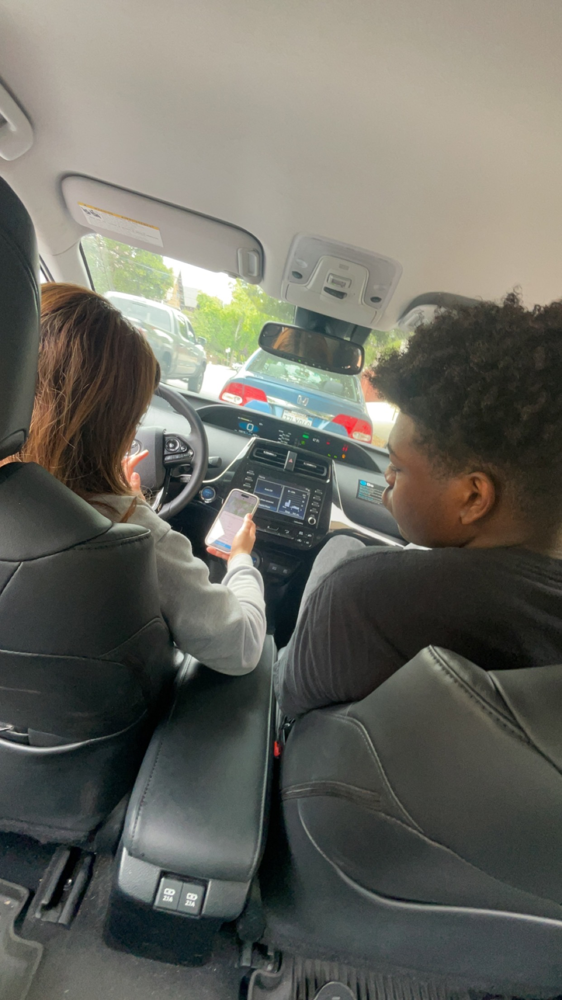

### Hey everyone! Here are some moments during Summer Rising that altered my brain chemistry... 

#1

#### Move-in Day with ALL my stuff 
# 

#2 

#### Grubbing at La Note on the 4th of July  
#

#3

#### Enrollment Day 
#

#4

#### Studying hard for our first math quiz :( 
#

#5

#### First Day in Lab 
#

#6

#### Sarah and I using public transportation and somehow arriving at the Golden Gate Bridge 
# 

#7 

#### and the next weekend going to the Painted Ladies 
#

#8 

#### Ezra with Oski 
#

#9

#### Hair time!
#

#10

#### Driving during our 2 hour break to get Canes
#

